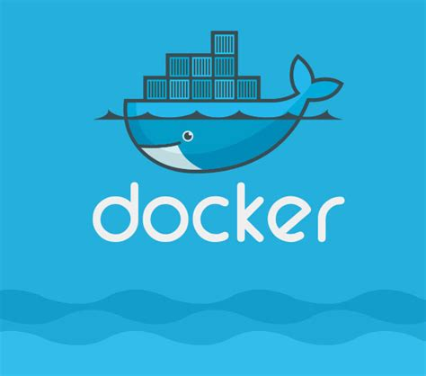

# To do List Docker

  
<strong>:us: English</strong>
 
  
## 💻 About the project

This repository contains a full-stack application: a to do list! This application needs to be containerized to work. I have developed the configuration files for each specific front: Front-end, Back-end and, for a test application that validates if the applications are communicating.

Project developed at Trybe, as part of their Back-end curriculum. 

The Back-end and the Front-end were provided by Trybe, and the configuration files for Docker were developed by me.

## 🚀 Built with
> This project were developed using the following technologies

- Docker

## 👩🏻‍💻 Skills

>In this project I have developed the following skills

- Learned how to use Docker commands in the Command Line Interface;
- Created Docker images of applications;
- Created and run Docker containers;
- Orchestrated containers using Docker Compose.
  
   

  
<strong>:brazil: Português</strong>
 

## 💻 Sobre o projeto

Esse repositório contém uma aplicação full-stack: um aplicativo de lista de tarefas! No desafio proposto, para a aplicação funcionar, ela precisa ser conteinerizada através do Docker. Os arquivos de front-end, back-end e testes foram fornecidos pela Trybe e, eu desenvolvi os arquivos de configuração do Docker.

## 🚀 Tecnologias
  
- Docker

## 👩🏻‍💻 Habilidades

>Nesse projeto desenvolvi as seguintes habilidades

- Aprendi como usar os comandos do Docker na interface de linha de comandos(CLI;
- Criei Imagens Docker de aplicacões;
- Criei e rodei Containers Docker;
- Orquestrei containers usando Docker Compose.
